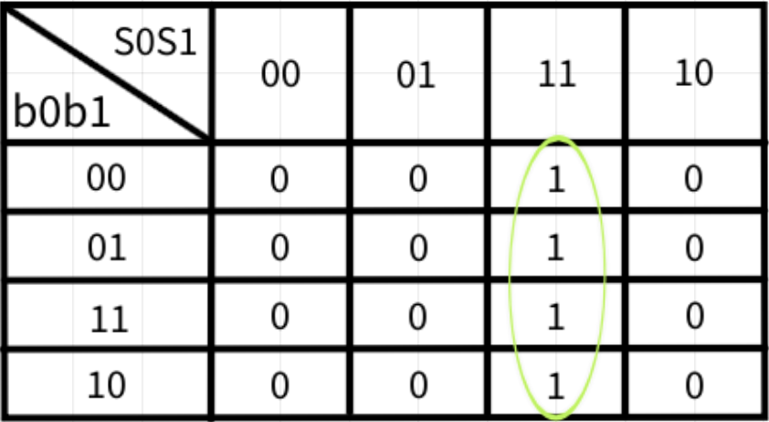

# Three Digits Combination Lock FSM
This is a three digit combination lock system with "123" as the password. At the first state, if the number inputted is 1, it will move to the second state, else return to the starting state. At the second state, if the number inputted is 2, it will move to the third state, else return to the starting state. At the third state, if the number inputted is 3, the lock will be openned, else return to the starting state. After that, any number (0-3) inputted will bring the system back to the starting state.

## FSM Model

Inputs explained:
00 = 1\n
01 = 2\n
10 = 3\n
11 = 0

## State and Transition Table
Here's the state and transition table derived from the diagram above

## Karnaugh Map
Here are the K-map for the next states and output
#### -N0

#### -N1

#### -Output

## Combinatorial Boolean Equations from Kmap
Here are the equations formed from each K-map above:
N0 = !S0S1!b0b1 + S0!S1b0!b1\n
N1 = !S0!S1!b0!b1 + S0!S1b0!b1\n
O1 = S0S1

## System Simulation in C

